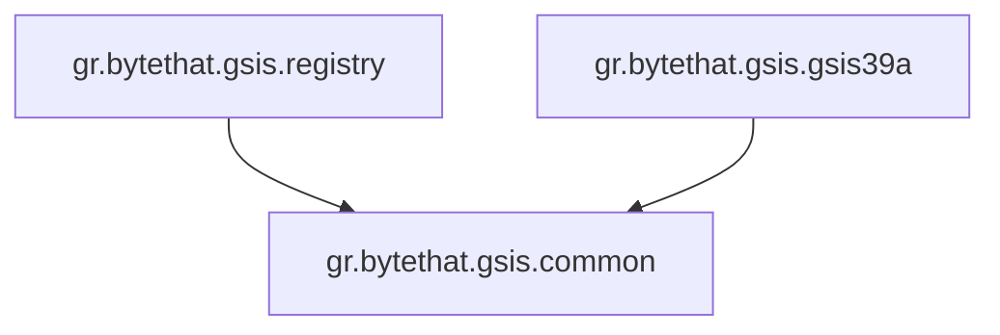

# Project Architectural & Layering Guidelines

This document serves as the official architectural guideline for further development of the Greek GSIS Integration application (`gr.bytethat.gsis`). All agents and developers must strictly adhere to these patterns.

---

## 1. Vertical Component Slicing

The application is split vertically into distinct, independent business modules. Each module encapsulates its own domain, client proxies, exceptions, and models.



### Components:
1. **`gr.bytethat.gsis.registry`**: Handles the Greek General Secretariat of Information Systems (GSIS) Public Registry lookup services (`RgWsPublic2`).
2. **`gr.bytethat.gsis.gsis39a`**: Handles the Greek Independent Authority for Public Revenue (AADE) Article 39a SOAP Web Service (`vt39afpaBu3GetBuyer`).
3. **`gr.bytethat.gsis.common`**: Serves as the single common shared module, encapsulating utility classes, common base exceptions, and core domain validations (e.g. `GreekVatValidator`).

---

## 2. Horizontal Layering Inside Components

Every vertical component is subdivided into three strict horizontal layers to maintain loose coupling, clean dependency injection, and a framework-agnostic domain core.

```
gr.bytethat.gsis.[component]
 ├── abstractions/    (Public API & Contracts)
 ├── core/            (Pure Business Logic & Implementations)
 └── infrastructure/  (Framework-specific adaptions: Spring, Jackson, JAX-WS Configs)
```

| Layer | Responsibility | Strict Rules & Constraints |
| :--- | :--- | :--- |
| **`abstractions`** | Defines the public API contract, interface declarations, custom domain exception definitions, and domain-pure models/enums. | **No framework leakage**. Do NOT import or use third-party annotations (such as Jackson `@JsonProperty`, Lombok `@Getter` is acceptable, Spring `@Component` / `@Service` / `@Repository` is forbidden). |
| **`core`** | Implements the interfaces defined in the `abstractions` layer, encapsulates private helper classes, mapping rules, and validator implementations. | **Free of framework or infrastructure concerns**. All implementations should be pure Java logic. External service configuration properties and low-level REST controllers belong outside. |
| **`infrastructure`** | Bridges the core business logic to external runtime environments. Houses Spring `@Configuration` beans, `@ConfigurationProperties`, JAX-WS SOAP configuration & dynamic security handlers, Jackson serializer bindings, and Web Auto-Configurations. | Handles all library and framework integrations. Direct integration mappings (like Jackson serializers) must reside here to keep the business core 100% clean. |

---

## 3. Modularity Guardrails & Best Practices

1. **Jackson Annotation Isolation**:
   No core domain classes or enums inside the `abstractions` or `core` packages of `gr.bytethat.gsis.registry` should contain Jackson-specific annotations (like `@JsonFormat`, `@JsonProperty`, or custom serialization decorators). Instead, register custom serializer bindings inside the component's `infrastructure` layer (e.g. `GsisJacksonConfiguration`).
2. **JAX-WS Port Proxy Thread-Safety**:
   Rather than instantiating the WSDL client on every single request, configure the underlying JAX-WS Service client once. Register its outbound WS-Security SOAP Handlers inside a Spring `@Configuration` bean, set connect/read timeouts natively on `BindingProvider.getRequestContext()`, and expose the Port proxy as a singleton bean.
3. **Java 25 Native Timeout Configuration**:
   Do not use raw internal Metro reflection properties directly on endpoints. Register both the modern standard keys and Metro keys on the request context map of JAX-WS client bindings:
   - Connect timeout: `jakarta.xml.ws.client.connectionTimeout` (and fallback `com.sun.xml.ws.connect.timeout`).
   - Read timeout: `jakarta.xml.ws.client.receiveTimeout` (and fallback `com.sun.xml.ws.request.timeout`).
